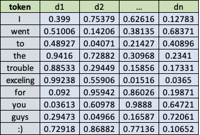
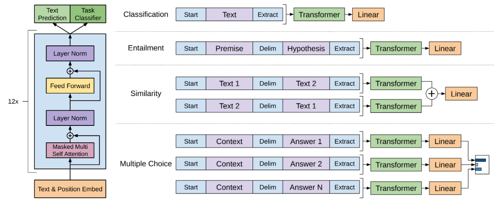
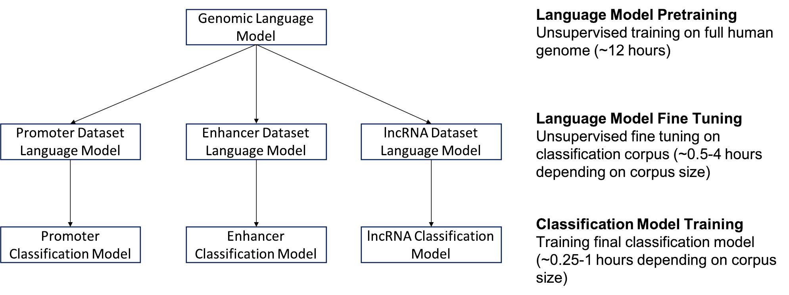

## Intro

Scott Mueller

###### smueller.tampa.ai@gmail.com

---
## Tampa.ai

Looking for Presenters

---
# NLP for Text Classification

https://meanderingstream.github.io/nlp_for_text_classification

---
* Embeddings vs Encodings
* Transfer Learning
* ELMO
* UMLFIT
* BERT
* GPT-2

---
## Embedding vs Encoding
---
## Embedding

Word2Vec and GloVe are Embeddings[1]
---
## Autoencoder

[2]
---
## NLP Encoder

[3]

---
## Transfer Learning

[4]

---
## Transfer Learning in Text

* Language Model

Predict the next word, given the previous word
---
## Language Model

the quick brown _______

|

Train on self-supervised, easy to capture, text dataset

Any text documents will work

Like wikitext-103
---
## What is important about a Language Model 

Expresses Syntax

Models Semantics

---
## How Big?

Easy to Obtain - How big do you want?

Takes time to build the reusable model

---
## ElMO

Embeddings from Language Model

[5]

---
## ULMFiT Approach

[4]

---
## ULMFiT

[4]

---
## Avoiding Forgetfulness

* Freezing Layers - Gradual Unfreezing

[6]

---
## Transformer

[5]

---
## OpenAI GPT

[5]

---
## BERT

[5]

---
## BERT LM Approach

Randomly mask 15% of tokens in each sequence. Because if we only replace masked tokens with a special placeholder [MASK], the special token would never be encountered during fine-tuning. Hence, BERT employed several heuristic tricks:
(a) with 80% probability, replace the chosen words with [MASK];
(b) with 10% probability, replace with a random word;
(c) with 10% probability, keep it the same.

---
## BERT LM Continued

The model only predicts the missing words, but it has no information on which words have been replaced or which words should be predicted. The output size is only 15% of the input size.

---

## GPT-2

* 1.5 Billion parameters

* Zero-shot transfer

* No fine tuning

---
## GPT-2 Zero Shot

* Translation: English sentence = Chinese sentence

* Q&A: question = answer

* Summarization: add TL;DR: after articles

---
## Using UMLFiT for Sentiment Analysis

[IMDb Sentiment Analysis Notebook](./nbs/lesson3-imdb.pdf)

---
## How could you use NLP?

Text portion of Insurance Claim, any hint of a fall in hospital?

Chat History, problem chats that need supervisor attention
---
## Genomics

[7]
https://github.com/kheyer/Genomic-ULMFiT
---
[7]

---
[7]

---
Questions?

---
## Study Group

https://ai-tampa-study-group.github.io/meetings/

---
### Resources
[1] https://medium.com/mlreview/understanding-building-blocks-of-ulmfit-818d3775325b

[2] https://en.wikipedia.org/wiki/Autoencoder

[3] https://arxiv.org/pdf/1801.06146.pdf

[4] https://towardsdatascience.com/transfer-learning-in-nlp-for-tweet-stance-classification-8ab014da8dde
---

### More Resources

[5] https://lilianweng.github.io/lil-log/2019/01/31/generalized-language-models.html

[6] https://yashuseth.blog/2018/06/17/understanding-universal-language-model-fine-tuning-ulmfit/

[7] https://github.com/kheyer/Genomic-ULMFiT

---

[KnowFalls.com](https://www.KnowFalls.com/)

Looking for Founder Fastai ML Practitioners

Elixir, Functional Programming, Rails, Experience
